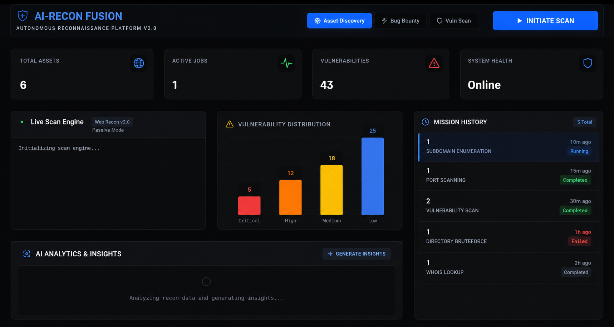

# GEMINIRECON v2.0

GEMINIRECON is a production-grade, AI-native reconnaissance and cybersecurity intelligence platform. It orchestrates advanced security tools, correlates technology stacks with vulnerability databases, and provides professional, evidence-based security assessments.

## 🌟 Professional Features

- **AI-Native Orchestration**: Multi-agent system manages the full Reconnaissance-Analysis-Risk-Report pipeline.
- **Skill-Based Reconnaissance**: Execute modular, versioned security methodologies such as "Bug Bounty Workflow" or "Advanced Infrastructure Recon".
- **Real-Time SOC Dashboard**: Monitor reconnaissance missions in real-time with live log streaming and vulnerability heatmaps.
- **Persistent Intelligence**: Leverages vector-based memory to store and recall historical findings across missions.
- **Automated Evidence-Based Reporting**: Generates professional, multi-page security reports (PDF) derived exclusively from validated tool data.
- **Cloud-Native Architecture**: Built for scale on a serverless-friendly stack (FastAPI, Redis, Supabase, Vercel).

## 🚀 Getting Started

1. **Deploy Frontend**: Accessible at [https://geminirecon-frontend.vercel.app](https://geminirecon-frontend.vercel.app).
2. **Backend**: Hosted on Render, utilizing a unified API and Worker process for efficient resource management.
3. **Scan**: Initiate a mission by selecting a Recon Skill and providing a target domain.

## 🛠️ Infrastructure Overview

- **Orchestration**: AI Agents using Gemini 2.0 / OpenRouter.
- **Database/Storage**: Supabase (PostgreSQL + pgvector).
- **Task Queue**: Upstash Redis.
- **Compute**: Render (Python/Docker) & Vercel (React).

---
*Autonomous Cybersecurity Intelligence Engine v2.0*
