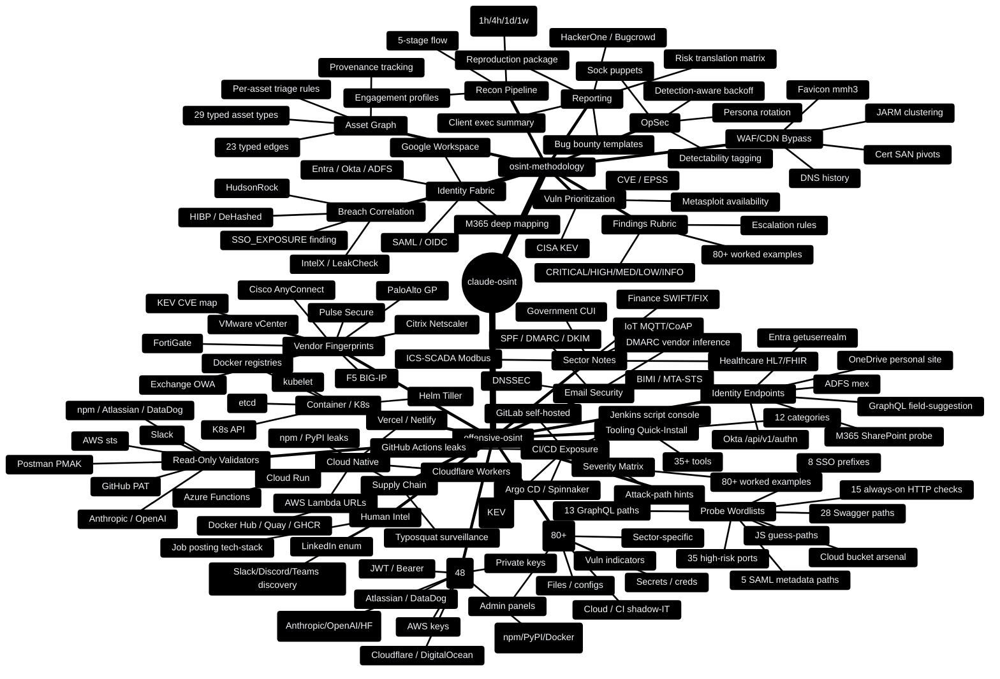
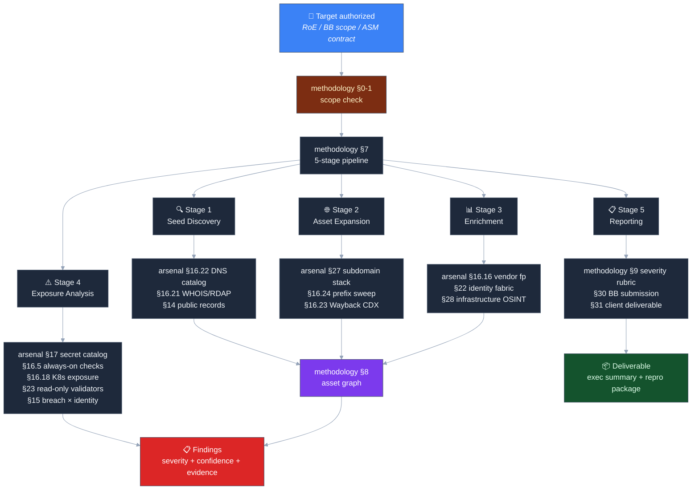

# claude-osint

> 2 production-ready offensive OSINT skills for Claude — drop-in `SKILL.md` files that turn Claude into a context-aware external recon operator for authorized red-team and bug-bounty engagements.

Built by **[ElementalSoul](https://github.com/elementalsouls)** — extracted from the operational tradecraft of the [Falcon-Recon](https://github.com/elementalsouls/falcon-recon) external attack-surface management platform.

---

## What is this?

`claude-osint` is a paired set of skills for the [Claude skills system](https://docs.claude.com/en/docs/claude-code/skills). Each skill is a structured `SKILL.md` file that primes Claude with expert-level methodology for one half of the offensive recon problem:

- **`osint-methodology`** — *how to think.* Strategic + procedural. Asset-graph discipline, severity rubric, time budgeting, identity-fabric mapping, deliverable templates.
- **`offensive-osint`** — *what to reach for.* Tactical arsenal. Probe paths, regexes, payloads, scoring rules, curl one-liners, tool URLs.

Drop both into your Claude environment and it behaves like a senior recon analyst: it knows the techniques, the tooling, the edge cases, and the escalation paths — and it stays in scope.

~5,500 lines of structured tradecraft · 96.9% PASS on a 32-prompt self-evaluation · ~85–90% practitioner coverage for the recon phase of authorized engagements.

---

## Structure

```
Claude-OSINT/
└── skills/
    ├── osint-methodology/
    │   └── SKILL.md
    └── offensive-osint/
        ├── SKILL.md
        └── scripts/
            └── secret_scan.py
```

Each directory is a self-contained skill. Point Claude at the relevant `SKILL.md` and the skill auto-triggers on relevant phrases.

---

## Skill Index

### Methodology — *"how to think"*

| Skill | Description |
|---|---|
| `osint-methodology` | 5-stage recon pipeline · asset-graph discipline (29 types, 23 edges) · severity rubric · identity-fabric mapping (Entra/Okta/ADFS/Google/SAML/M365 deep) · breach × identity correlation · WAF/CDN bypass · vulnerability prioritization (CVE/EPSS/KEV) · phishing infrastructure planning · bug-bounty submission templates · client deliverable templates |

### Arsenal — *"what to reach for"*

| Skill | Description |
|---|---|
| `offensive-osint` | Pre-built wordlists & probe paths (Swagger/GraphQL/SAML/SSO/cloud buckets/vendor fingerprints/K8s/CI-CD) · 48-pattern secret-regex catalog (incl. modern AI APIs) · 80+ dork corpus · 9 read-only secret validators · endpoint interest score · attack-path hint templates · severity decision matrix · LinkedIn/job/Slack/Discord enumeration · package registry leak hunting · sat imagery · sector-specific recon · runnable `secret_scan.py` |

Most prompts pull both — they're complementary, not overlapping. Full §-by-§ breakdown lives in [`docs/architecture.md`](docs/architecture.md) and each skill's `SKILL.md` frontmatter.

---

## Capability Mindmap

What the paired skills can actually do, at a glance:



---

## Engagement Flow

How a typical authorized engagement walks through both skills:



---

## Usage

### With Claude Code

```bash
git clone https://github.com/elementalsouls/Claude-OSINT.git
cd Claude-OSINT

# One-time after clone: populate full SKILL.md content
./scripts/sync-skill-content.sh

# Install both skills
mkdir -p ~/.claude/skills
cp -r skills/* ~/.claude/skills/
```

Then in any Claude Code session, just ask an OSINT question — the skills auto-trigger on relevant phrases.

### With the Claude Skills System

Place either skill folder under your configured skills path (e.g. `/mnt/skills/user/`) and Claude will auto-load it based on trigger keywords. Both skills declare 50+ trigger phrases each.

### Manual (Claude.ai / Claude API)

Paste the contents of any `SKILL.md` into a Project's system prompt or prepend it to your conversation. Both files are plain Markdown — also usable as a personal cheat-sheet without Claude.

---

## Authorization

These skills are intended for assets you **own** or have **written authorization to assess** (red-team rules of engagement, bug-bounty in-scope assets, ASM contracts).

Both skills include a soft scope-check when you ask Claude to act against an unverified third-party target. They explicitly **exclude** active exploitation, post-exploitation, malware development, and other activities beyond OSINT-driven reconnaissance. See [`SECURITY.md`](SECURITY.md) for the full posture.

---

## Documentation

| Doc | Contents |
|---|---|
| [`docs/architecture.md`](docs/architecture.md) | Design philosophy · asset-graph model · confidence/severity/detectability models · sidecar coordination · diagrams |
| [`docs/coverage.md`](docs/coverage.md) | Honest practitioner-coverage breakdown by archetype + engagement phase |
| [`docs/installation.md`](docs/installation.md) | Symlink installs and multi-environment install patterns |
| [`docs/usage.md`](docs/usage.md) | Trigger-phrase reference and prompt templates |
| [`examples/`](examples/) | 4 end-to-end engagement walk-throughs (quick recon · bug-bounty · M365 deep · secret hunting) |
| [`tests/smoke-test-prompts.md`](tests/smoke-test-prompts.md) | 32-prompt self-evaluation suite (current grade: 31/32 PASS) |
| [`CHANGELOG.md`](CHANGELOG.md) | Version history |
| [`CONTRIBUTING.md`](CONTRIBUTING.md) | Pull-request guidelines |

---

## About

These skills were developed through the operational tradecraft of [Falcon-Recon](https://github.com/elementalsouls/falcon-recon), an external attack-surface management platform. The 90+ modules correspond closely to Falcon-Recon's implemented techniques — generalized so they apply to any OSINT engagement (with or without Falcon-Recon).

**Author:** [ElementalSoul](https://github.com/elementalsouls)
**Original framework:** [SnailSploit/offensive-checklist](https://github.com/SnailSploit/offensive-checklist) (v1.x)
**Inspired by:** [Bellingcat's Online Investigations Toolkit](https://www.bellingcat.com/resources/2024/09/24/bellingcat-online-investigations-toolkit/) · [IntelTechniques](https://inteltechniques.com/tools/) · [OSINT Framework](https://osintframework.com/)
**Tool inventory:** [ProjectDiscovery](https://github.com/projectdiscovery) · [Six2dez reconftw](https://github.com/six2dez/reconftw) · [SecLists](https://github.com/danielmiessler/SecLists) · [Assetnote Wordlists](https://wordlists.assetnote.io/)
**License:** MIT — use freely, attribution appreciated.

---

> *"Give Claude the right skill and it stops being a chatbot. It becomes an operator."*
